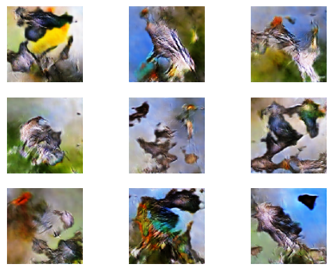
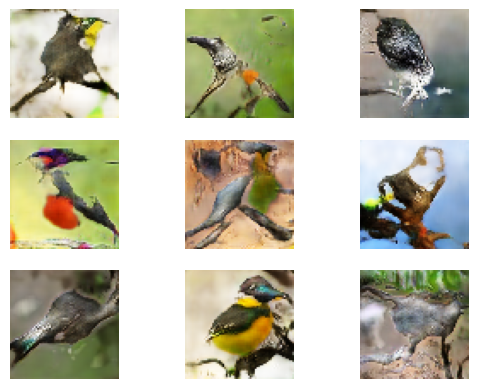
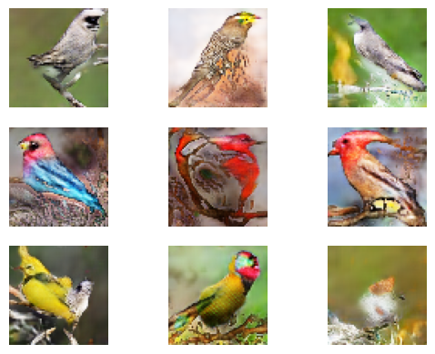

# Bird Deep Convolutional GAN
This is an implementation of a DCGAN which generates images of birds.

[For faster training, it is recommended to run tensorflow on GPU. For reference, it takes a few hours (depending on the number of epochs) for this code to run on NVIDIA GeForce GTX 1660. For more information check out https://www.tensorflow.org/install/gpu]

Here is are examples of some randomly chosen generated images (64x64 pixels) at epoch 20, 200, and 400:

